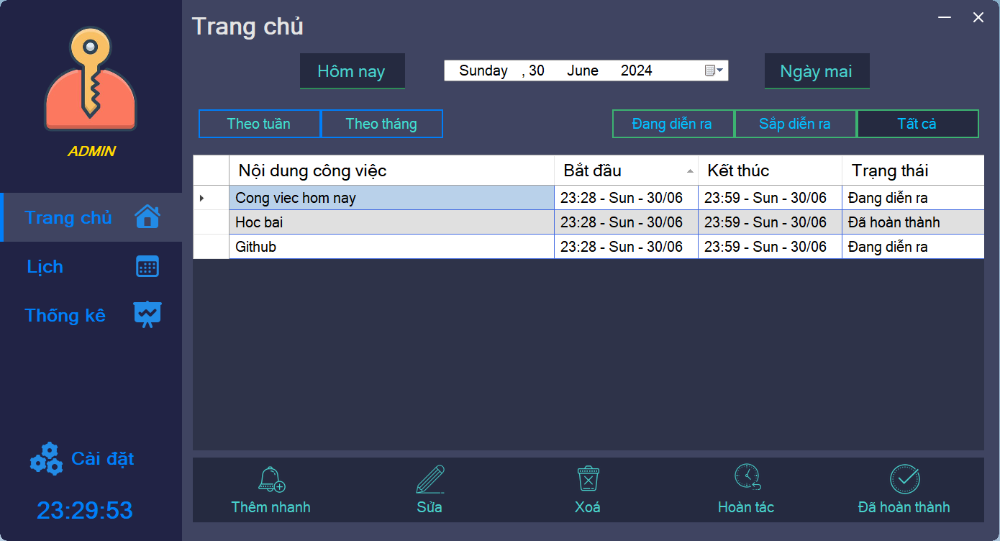
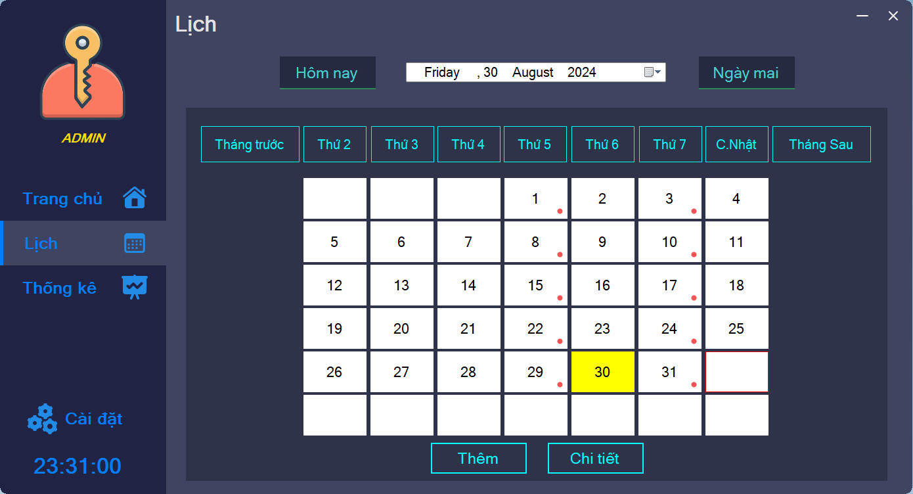
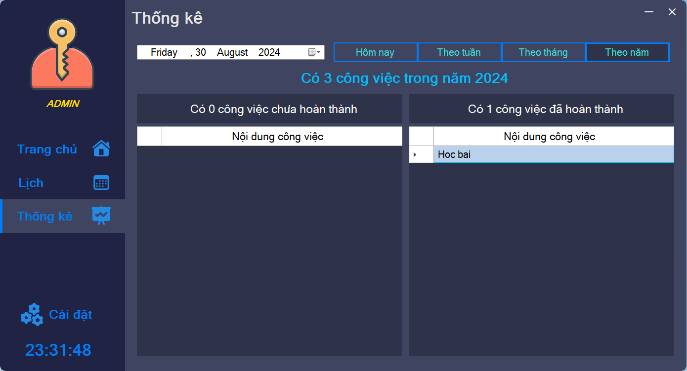
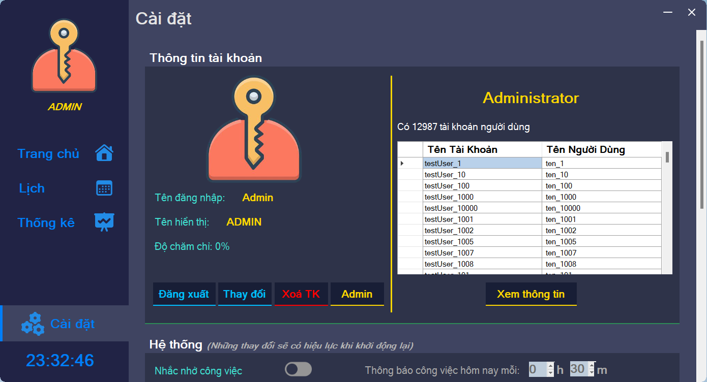

# JobsManagement
TTCSN_Group8
- Đinh Thị Mỹ Tâm
- Đinh Thanh Sáng
- Vũ Duy Khánh
- Vũ Đình Trí
- Đặng Đức Trung

Sản phẩm: ___Phần mềm quản lý công việc JobsManagement___
## Giao diện & chức năng chính
* Giao diện màn hình chính
  
* Giao diện xem lịch
  
* Giao diện thống kê
  
* Giao diện cài đặt
  
## Các tính năng
- Quản lý công việc
- Đặt công việc lặp lại theo các ngày trong tuần
- Xem lịch
- Thống kê các công việc đã và chưa hoàn thành
- Đặt lịch nhắc nhở số lượng công việc
- Quản lý thông tin các tài khoản (Admin)
## Cài đặt phần mềm
- Bước 1: Tải và cài đặt 
    - SQL Server bản [__Express__](https://www.microsoft.com/en-us/sql-server/sql-server-downloads)
    - [__SQL Server Management Studio (SSMS)__](https://learn.microsoft.com/en-us/sql/ssms/download-sql-server-management-studio-ssms?view=sql-server-ver16)
- Bước 2: Mở folder [Setup](https://github.com/TrungDang143/TTCSN_N8_JobsManagement/tree/master/Setup), execute file Database.sql bằng [__SSMS__](https://learn.microsoft.com/en-us/sql/ssms/download-sql-server-management-studio-ssms?view=sql-server-ver16)
- Bước 3: Chạy file JobsManagement.msi
   
